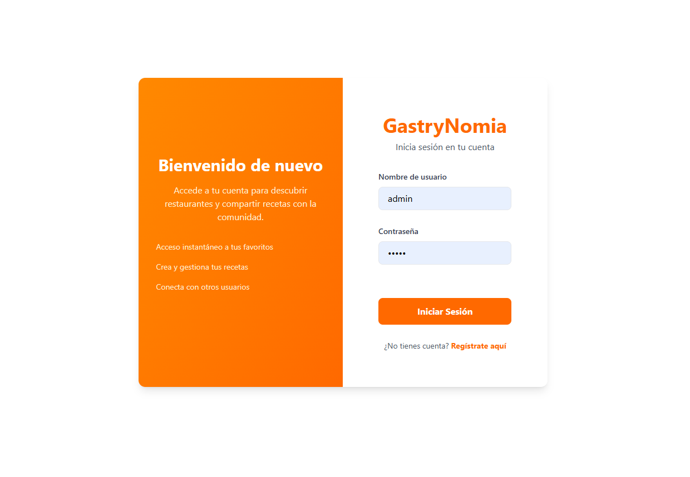
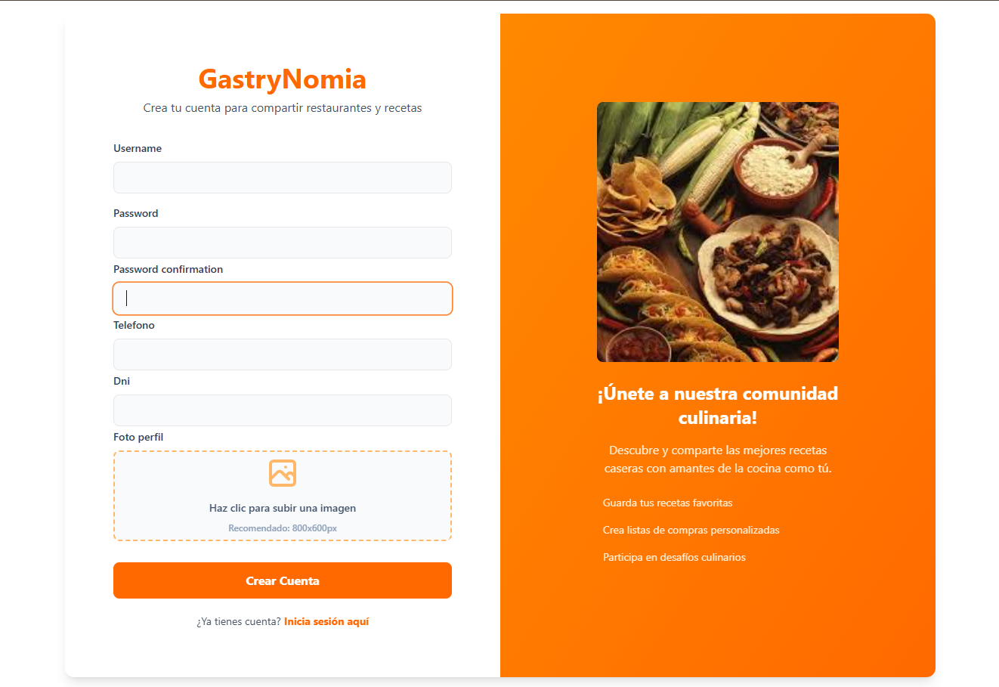
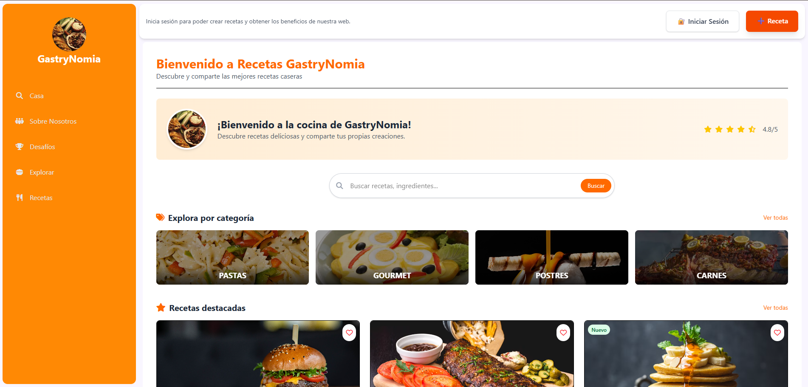
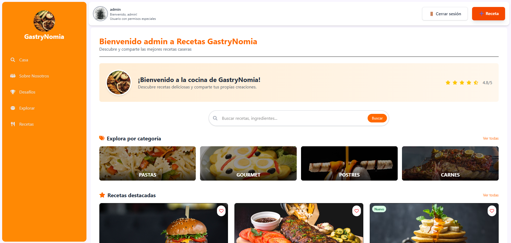
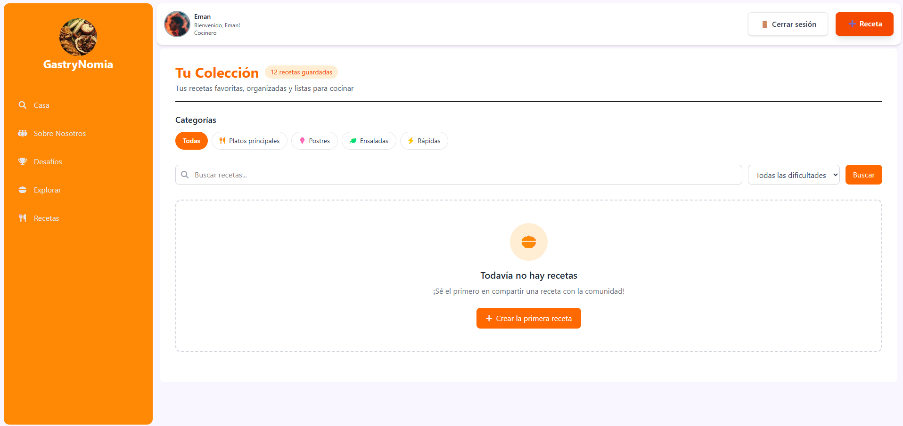
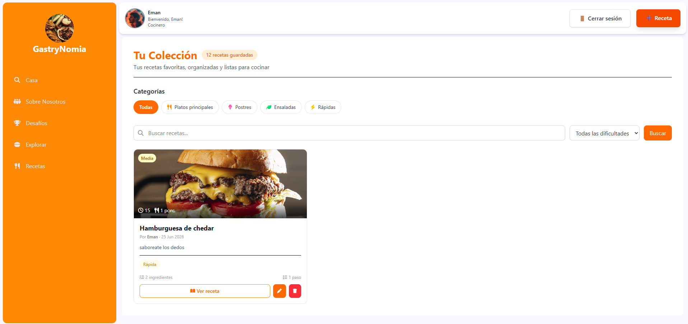
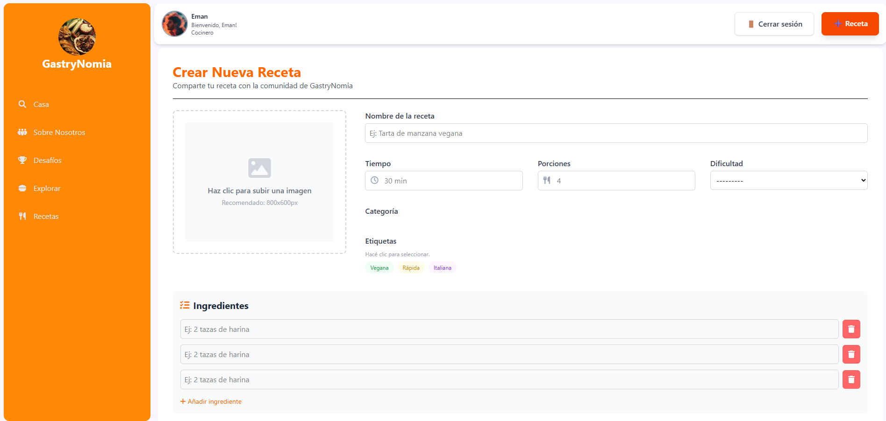
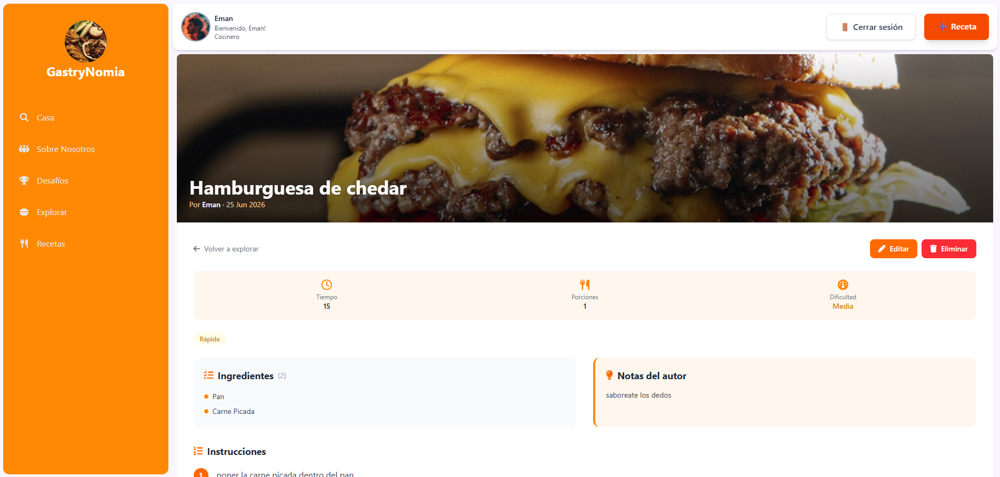

# GastryNomia

GastryNomia es una aplicación web de recetas construida con Django. Permite a los usuarios registrarse, crear, editar, eliminar y explorar recetas, así como gestionar etiquetas y categorías. El proyecto incluye autenticación personalizada y carga de imágenes de usuario y recetas.

## Características principales

- Página de Landing con información del proyecto.
- Registro y login de usuarios (autenticación Django personalizada).
- Exploración de recetas con filtro por nombre y dificultad.
- Visualización de detalle de receta con ingredientes, pasos, etiquetas y categorías.
- Creación de recetas con formulario dinámico de ingredientes y pasos.
- Edición y eliminación de recetas con permisos basados en autor y roles.
- Gestión de etiquetas con colores personalizados.
- Uso de plantilla base compartida y Tailwind CSS.
- Soporte para archivos multimedia (`MEDIA_ROOT`) y configuraciones de `media/`.

## Tecnologías

- Django 6.0
- Python
- SQLite
- Tailwind CSS
- Django Browser Reload

## Requisitos

- Python 3.10 o superior
- `pip`
- Entorno virtual recomendado

## Instalación

1. Clona o copia el proyecto en tu equipo.
2. Crea y activa un entorno virtual:

```powershell
python -m venv .venv
.venv\Scripts\Activate.ps1
```

3. Instala las dependencias:

```powershell
pip install -r requirements.txt
```

4. Aplica las migraciones:

```powershell
python manage.py migrate
```

5. Crea un superusuario si lo necesitas:

```powershell
python manage.py createsuperuser
```

## Adicional de uso en Admin
solo el Admin puede crear categorias y asignarle a grupo de editores a los usuarios, los usuarios recien creados seran "Cocineros" por defecto, los cuales no tendran la posibilidad de usar las funcionalidades de CRUD solo crear. 


## Configuración

- Revisa `GastryNomia/settings.py` para ver la configuración de `AUTH_USER_MODEL`, `MEDIA_URL` y `MEDIA_ROOT`.
- En desarrollo, `MEDIA_URL` sirve los archivos subidos automáticamente cuando `DEBUG = True`.
- Asegúrate de tener el directorio `media/` con permisos de escritura.

## Ejecución
Debido al uso de Tailwind, en modo desarollo, es necesario el uso de un servidor aparte de Tailwind.
Para el uso en Windows fue necesaria la creacion de un archivo donde se ejecutan los servidores tanto de Django como Tailwind, por lo que se creó un archivo `dev.bat` en el directorio raíz del proyecto.

Para ejecutar el servidor, en Windows es necesario abrir un terminal en `dev.bat` y presionar enter.
```powershell
./dev
```

Luego abre el navegador en `http://127.0.0.1:8000/`.

## Uso

- Página principal: `/`
- Sobre el proyecto: `/about/`
- Retos: `/challenges/`
- Explorar recetas: `/explorar/`
- Crear receta (usuarios con permiso): `/recipes/`
- Iniciar sesión: `/accounts/login/`
- Registrar usuario: `/accounts/register/`

### Flujo de la aplicación

- El usuario se registra y accede al sitio.
- Desde la sección de exploración puede buscar recetas y ver detalles.
- Si el usuario tiene permiso, puede añadir nuevas recetas y editar o eliminar las que ha creado.
- Las recetas incluyen ingredientes, pasos, etiquetas, categorías y notas.

## Estructura del proyecto

- `GastryNomia/`: configuración global del proyecto.
- `Landing/`: aplicación principal de recetas y páginas públicas.
- `Users/`: aplicación de usuarios con modelo `UsuarioPersonalizado`.
- `templates/`: plantillas globales y de autenticación.
- `media/`: archivos subidos (fotos de perfil, imágenes de recetas).
- `requirements.txt`: dependencias del proyecto.
- `db.sqlite3`: base de datos SQLite de desarrollo.
- `dev.bat`: script para iniciar el servidor Django en modo desarrollo.`
- `Readme.md`: descripción del proyecto y guía para la instalación.

## Capturas de pantalla
>Login


>Registro


>Landing sin usuario logueado


>Landing con usuario logueado


>Explorador de recetas sin recetas



>Explorador de recetas con recetas


>Explorador de recetas con recetas


>Explorador de recetas con recetas



## Notas adicionales

- El modelo de usuario extendido `Users.UsuarioPersonalizado` incluye campos de teléfono, DNI y foto de perfil.
- Las etiquetas tienen colores predefinidos y se usan para clasificar recetas visualmente.
- El proyecto está pensado para funcionar en modo desarrollo; para producción deberías ajustar `DEBUG`, `SECRET_KEY`, `ALLOWED_HOSTS` y la configuración de archivos estáticos/media.
